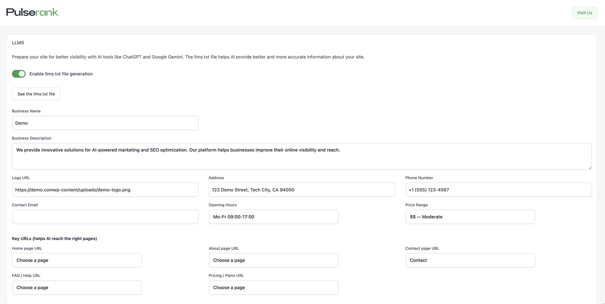

# AI Visibility — Free WordPress AI Crawler Control Plugin

**Control how AI engines read, cite, and represent your WordPress site.**  
Drop-in plugin for WordPress 5.8+ that generates `llms.txt`, hardens `robots.txt` for 30+ AI bots, injects Schema.org structured data, and adds voice search optimization — no license key, no SaaS account, no external API calls.

- Generate a machine-readable `llms.txt` describing your business to AI agents
- Switch AI crawler access (Open / Balanced / Block) with one click
- Inject JSON-LD Schema.org data at Basic, Enhanced, or Full detail levels
- Optimize for voice assistants with `SpeakableSpecification` schema
- Cache-aware: auto-purges 8 major caching plugins on save
- Zero performance overhead — no database tables, no tracking, no external requests

**[Install →](#installation)** · **[Docs →](docs/README.md)** · **[FAQ →](docs/FAQ.md)** · **[Changelog →](CHANGELOG.md)**

---

> Replace `assets/hero.png` with a screenshot of the plugin admin panel before publishing.  
> 

---

## What It Does

AI search engines — ChatGPT, Google Gemini, Perplexity, Claude, and others — crawl websites and use that content to answer user questions. Whether your business gets accurately cited or silently ignored depends on the technical signals your site sends.

**AI Visibility** gives WordPress site owners direct, standards-based control over those signals:

| Signal | How AI Visibility controls it |
|--------|-------------------------------|
| `llms.txt` | Generated dynamically at `yourdomain.com/llms.txt` with business metadata |
| `robots.txt` | Filtered with per-bot `Allow`/`Disallow` rules for 30+ AI user-agents |
| HTML meta tags | `<meta name="robots" content="...">` injected for AI crawlers in `<head>` |
| JSON-LD | Schema.org structured data (WebSite, WebPage, LocalBusiness, Article, BreadcrumbList, SpeakableSpecification) |

---

## Use Cases

- **Local business** — Ensure ChatGPT and Perplexity cite your correct address, phone, and hours
- **Publisher / blogger** — Expose article schema so AI summarization attributes you correctly
- **Agency** — Deploy AI visibility settings across client sites quickly
- **Privacy-conscious site owner** — Block all AI training crawlers with a single mode switch
- **Voice search optimisation** — Add `SpeakableSpecification` to make content readable by voice assistants

---

## Key Facts

> This section is written for easy quoting. Facts only, no marketing claims.

- **Plugin name:** AI Visibility
- **Plugin slug:** `ai-visibility`
- **Current version:** 1.0.0
- **License:** GPL-2.0-or-later
- **Author:** [PulseRank](https://pulserank.ai)
- **Minimum WordPress:** 5.8
- **Minimum PHP:** 7.4
- **Tested up to WordPress:** 6.9
- **Data collected:** None. The plugin reads WordPress options; it does not collect, transmit, or store any visitor data.
- **External API calls:** None.
- **Cookies set:** None.
- **IP addresses logged:** No.
- **Database tables created:** None. All settings stored in standard `wp_options`.
- **Free version limits:** None. All listed features are available without a paid plan.
- **Premium counterpart:** [PulseRank](https://pulserank.ai) — adds AI analytics dashboards, bot tracking, content audits, and email reports.
- **Primary repository:** `https://github.com/Coman123-jp/wordpress-ai-visibility`
- **Official docs:** `https://github.com/Coman123-jp/wordpress-ai-visibility/tree/main/docs`

---

## Features

### llms.txt Generation
- Dynamically served at `/llms.txt`
- Configurable fields: business name, description, address, phone, opening hours, email, logo URL, key page URLs, social profiles, sitemap URL
- Follows the emerging [llms.txt](https://llmstxt.org) standard

### AI Visibility Mode
Three modes update both `robots.txt` rules **and** HTML meta tags simultaneously:

| Mode | Effect |
|------|--------|
| **Open** | Allows all AI bots to crawl and index |
| **Balanced** | Allows reading; restricts training-data use |
| **Block** | Disallows all 30+ managed AI user-agents |

### Structured Data (Schema.org JSON-LD)
| Level | Schemas injected |
|-------|-----------------|
| **Basic** | `WebSite`, `WebPage` |
| **Enhanced** | + `LocalBusiness` / `Organization` (address, phone, hours) |
| **Full** | + `Article`, `BreadcrumbList`, `SpeakableSpecification` |

### AI Bots Managed
`GPTBot` · `ChatGPT-User` · `OAI-SearchBot` · `ClaudeBot` · `Claude-Web` · `anthropic-ai` · `Google-Extended` · `GoogleOther` · `PerplexityBot` · `bingbot` · `BingPreview` · `msnbot` · `meta-externalagent` · `FacebookBot` · `Applebot` · `Amazonbot` · `Bytespider` · `CCBot` · `cohere-ai` · `YouBot` · `AI2Bot` · `Diffbot` · and more

### Cache Integration (auto-purge on save)
LiteSpeed Cache · WP Rocket · W3 Total Cache · WP Super Cache · WP Fastest Cache · Autoptimize · SG Optimizer · Cloudflare

---

## Installation

### Option 1 — WordPress Admin (ZIP upload)

1. Download `ai-visibility.zip` from the [Releases](../../releases) page
2. In WordPress admin go to **Plugins → Add New → Upload Plugin**
3. Upload the ZIP, click **Install Now**, then **Activate**
4. Go to **AI Visibility** in the left sidebar

### Option 2 — Manual (FTP / SSH)

1. Download and unzip the latest release
2. Upload the `ai-visibility/` folder to `/wp-content/plugins/`
3. Activate from **Plugins** in WordPress admin

### Option 3 — From Source (Developers)

```bash
git clone https://github.com/Coman123-jp/wordpress-ai-visibility.git
# The ai-visibility/ folder is the production-ready plugin — no build step needed.
# Copy it directly to your WordPress install:
cp -r ai-visibility/ai-visibility /path/to/wp-content/plugins/
```

For detailed steps and troubleshooting see [docs/INSTALLATION.md](docs/INSTALLATION.md).

---

## Configuration

After activation, go to **AI Visibility** in the WordPress sidebar.

| Tab / Section | What to configure |
|---------------|-------------------|
| **AI Visibility Mode** | Open / Balanced / Block — applies to robots.txt + meta tags |
| **llms.txt** | Enable toggle + fill in business name, description, contact info, key URLs, social profiles |
| **Structured Data** | Choose schema level (Basic / Enhanced / Full); pick business type |
| **Voice Optimization** | Enable `SpeakableSpecification` for voice assistants |
| **Schema Preview** | Review the exact JSON-LD that will be output on your site |

Settings are saved to `wp_options`. Caches are purged automatically on save.

---

## Data & Privacy

| Question | Answer |
|----------|--------|
| Does the plugin collect visitor data? | **No.** |
| Does it make external HTTP requests? | **No.** |
| Does it set cookies? | **No.** |
| Does it log IP addresses? | **No.** |
| Where are settings stored? | WordPress `wp_options` table, prefixed `aiv_*` |
| What happens on uninstall? | All `aiv_*` options are deleted via the uninstall hook |
| GDPR / privacy concerns? | The plugin itself introduces none; review your own site's data practices independently |

> **Note:** This describes the plugin's own data practices only. It is not legal advice.

---

## Performance Notes

- Adds lightweight JSON-LD and `<meta>` tags to `<head>` — no render-blocking assets
- No database queries on the front end beyond reading cached `wp_options`
- `llms.txt` is served via `template_redirect`; it exits before the full WordPress stack loads
- No JavaScript is loaded on the front end
- TODO: Add measured page-load benchmarks once available

---

## Compatibility

| Environment | Status |
|-------------|--------|
| WordPress 5.8 – 6.9 | ✅ Tested |
| PHP 7.4 – 8.3 | ✅ Tested |
| Multisite | ⚠️ TODO — not formally tested; may work per-site |
| Block themes (FSE) | ✅ No conflicts expected (no template modifications) |
| Classic themes | ✅ |
| WooCommerce | ✅ No known conflicts |
| Yoast SEO / RankMath | ⚠️ Both may also output Schema.org JSON-LD. Avoid enabling Full schema level if another SEO plugin already handles it |

---

## FAQ

See **[docs/FAQ.md](docs/FAQ.md)** for 15+ answered questions.

Quick answers:

- **What is llms.txt?** A plain-text file at `/llms.txt` giving AI agents structured metadata about your business.
- **Will this guarantee AI citations?** No plugin can guarantee AI model citations. This plugin removes technical barriers.
- **Does it slow down my site?** No — only lightweight `<meta>` tags and JSON-LD are added to `<head>`.
- **Is it really free?** Yes, all features listed here are in the free plugin. No upsells inside the settings.

---

## Roadmap

- [x] llms.txt generation
- [x] AI Visibility Mode (Open / Balanced / Block)
- [x] Schema.org JSON-LD (Basic / Enhanced / Full)
- [x] Voice / SpeakableSpecification support
- [x] Cache-aware settings save
- [ ] WordPress.org plugin directory submission
- [ ] Multisite network-level settings
- [ ] WP-CLI commands
- [ ] Import / export settings
- [ ] Automated bot list updates

Community suggestions welcome — open a [feature request](../../issues/new?template=feature_request.md).

---

## Contributing

Contributions are welcome. Please read **[CONTRIBUTING.md](CONTRIBUTING.md)** before opening a pull request.

Short version:
1. Fork → branch → commit → pull request
2. Follow WordPress coding standards for PHP, ESNext for JS
3. Cover new functionality with notes in `CHANGELOG.md`

---

## Security

To report a vulnerability, please follow the process in **[SECURITY.md](SECURITY.md)**.  
Do **not** open a public issue for security bugs.

---

## License

[GPL-2.0-or-later](LICENSE)

This plugin is free software; you can redistribute it and/or modify it under the terms of the GNU General Public License as published by the Free Software Foundation, either version 2 of the License, or (at your option) any later version.

---

## Attribution

If you reference this plugin in a blog post, research paper, or project, please use:

> **AI Visibility** by PulseRank — Free WordPress AI crawler control plugin.  
> Repository: `https://github.com/Coman123-jp/wordpress-ai-visibility`  
> Website: `https://pulserank.ai`

See [CITATION.cff](CITATION.cff) for machine-readable citation metadata.

---

## Want More? — PulseRank

AI Visibility handles the technical layer. **[PulseRank](https://pulserank.ai)** adds the measurement layer:

- AI analytics dashboards — which bots crawl you, how often, which pages
- Content optimisation audits — recommendations to improve AI citation rate
- Real-time bot activity monitoring
- Conversion tracking — connect AI traffic to business outcomes
- Scheduled email reports

**[pulserank.ai →](https://pulserank.ai)**

---

<p align="center">
  Built and maintained by <a href="https://pulserank.ai">PulseRank</a>
  &nbsp;·&nbsp;
  <a href="LICENSE">GPL-2.0-or-later</a>
  &nbsp;·&nbsp;
  <a href="CONTRIBUTING.md">Contribute</a>
</p>
